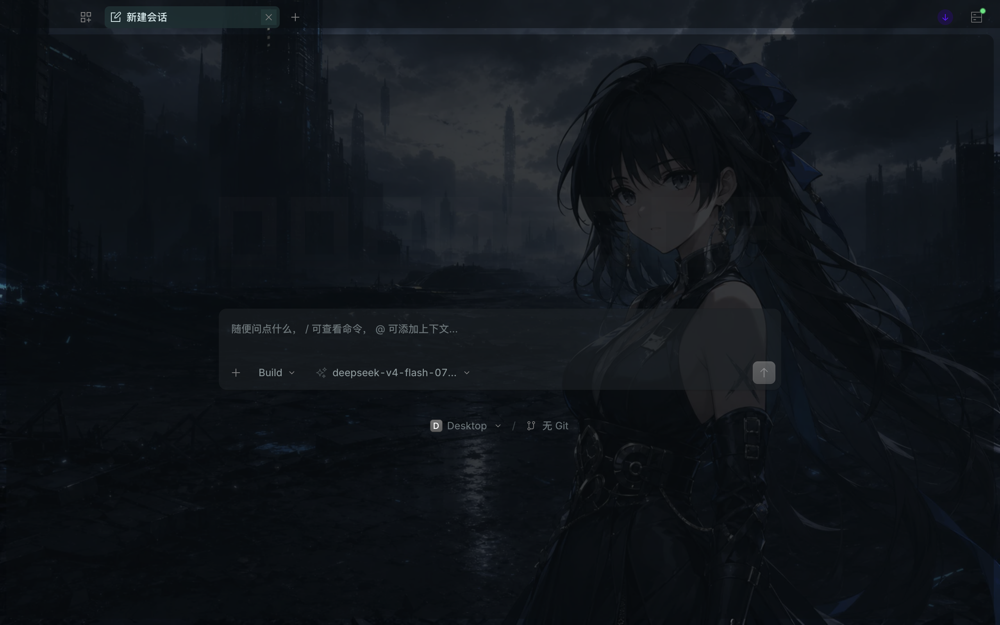
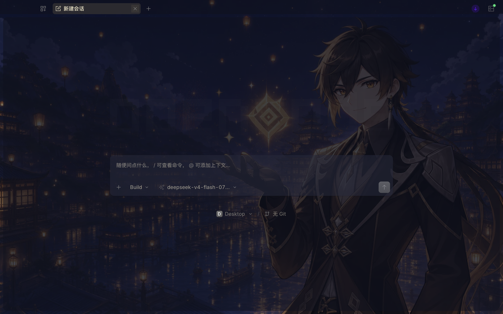
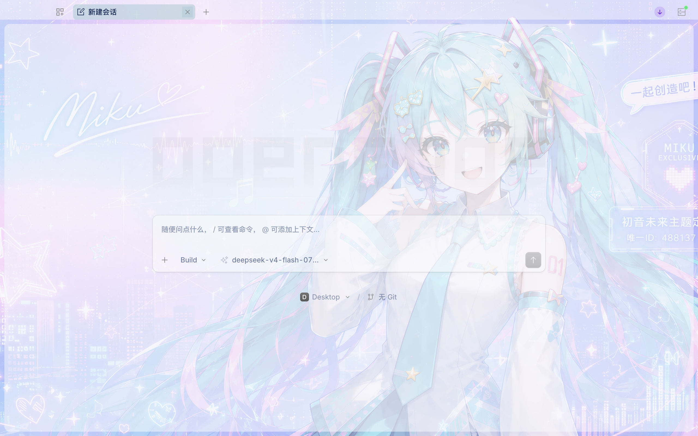
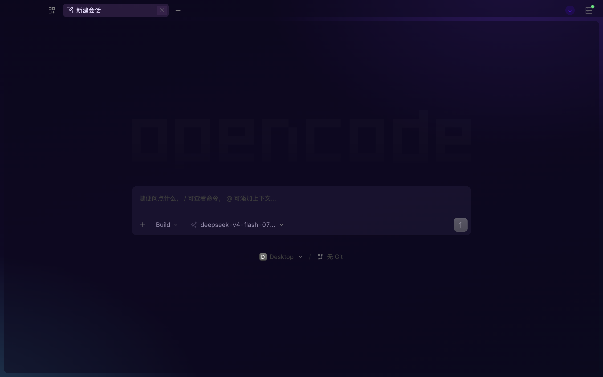

# OpenCode Skin | OpenCode 换肤工具

<div align="center">

**写代码的地方，也该是你喜欢的样子。**

28 套内置主题：22 套背景图/渐变 + 6 套色相配方。装好之后换肤只是终端里的一次回车，随时一键还原官方外观。

*Reskin OpenCode Desktop through loopback CDP injection. Native controls stay fully interactive.*

[](LICENSE)


[快速开始](#快速开始macos) · [做你自己的主题](#做你自己的主题) · [内置 28 套主题](#内置-28-套主题) · [使用须知](#使用须知都是实话) · [English](README.en.md)

</div>

> ## 🆕 0.1.0 首发
>
> 换肤引擎双模式：**调色板直搬**（22 套背景图/渐变主题，完整语义配色原值注入）+ **色相配方**
> （一个 `hue` 自适应染色当前界面）。守护进程刷新/重启自动补回皮肤，`create-theme.mjs` 一张图
> 全自动生成主题。完整变更见 [CHANGELOG.md](CHANGELOG.md)。

## 它长这样

下面是内置主题在 OpenCode 里的真实截图（空会话窗口）。注入后背景铺满整窗，侧栏、输入框、对话区全是 OpenCode 原生控件，可以正常点。

| 鸣潮 · 声骸 | 原神 · 星夜 |
| --- | --- |
|  |  |

| Miku 488137 | 赛博霓虹 |
| --- | --- |
|  |  |

## 快速开始（macOS）

环境要求：macOS + Node.js 22 及以上（零 npm 依赖，CDP 通信用 Node 自带的 WebSocket 和 fetch）。
OpenCode 默认不带调试端口，换肤前先执行一次：

```bash
bash apply-skin.sh        # 退出 OpenCode → 带端口(9345)重启 → 注入默认主题，会话数据不丢
bash install-daemon.sh    # 可选：皮肤保活 + 恢复提醒（刷新/重启后自动补回）
bash make-launcher.sh     # 可选：「OpenCode 皮肤.app」到 ~/Applications，双击恢复上次皮肤
bash uninstall.sh         # 彻底卸载：页面注入 + 守护进程 + 启动器 + launchd 注册 + 工具目录
```

日常换肤**不重启 OpenCode、立即生效**：

```bash
bash use-skin.sh          # 交互菜单：输入编号或名字切换
bash use-skin.sh 21       # 按编号切换
bash use-skin.sh 折纸      # 按名字切换（支持中文模糊匹配）
bash use-skin.sh 还原      # 移除皮肤，恢复官方外观
```

名字匹配规则：先按目录名匹配，再按显示名模糊匹配（忽略空格和中点，「鸣潮声骸」「鸣潮 声骸」「鸣潮」效果相同）。

`apply-skin.sh` 的重启动作由 macOS launchd 以系统任务执行，独立于 OpenCode 进程，内置保底：无论哪步失败，最后都会确保 OpenCode 处于运行状态。也可以手动带端口启动（效果等同）：`open -a "OpenCode" --args --remote-debugging-address=127.0.0.1 --remote-debugging-port=9345`。

> ⚠️ 工具目录不要放在「下载」「桌面」「文稿」这类受 macOS 隐私保护的文件夹：launchd 无法执行其中的脚本（报 `Operation not permitted`），`apply-skin.sh` 会失败。

## 皮肤守护进程与启动器

守护进程（LaunchAgent，`install-daemon.sh` 安装、`uninstall-daemon.sh` 卸载）做两件事：

1. **皮肤保活**：OpenCode 刷新/重启导致皮肤丢失时，每 5 秒巡检一次自动补回（等应用自己的主题落定再收割，抢跑会染错底色）
2. **恢复提醒**：OpenCode 被普通方式（启动台/访达）重启后调试端口消失，弹 macOS 系统通知提醒恢复。**守护进程自己绝不会重启 OpenCode**

「OpenCode 皮肤.app」启动器（`make-launcher.sh` 生成到 `~/Applications`）双击即可：OpenCode 在跑但皮肤丢了 → 按上次主题自动恢复（不重启 OpenCode），成功后弹系统通知；端口丢了 → 弹窗指引恢复命令；顺带自检守护进程（没在跑就重新拉起）。电脑重启、OpenCode 升级或皮肤意外丢失后，双击这个 App 就行。启动器逻辑住在仓库里的 `launcher-app.sh`（app 只是指向它的薄包装），改逻辑不用重新生成。

`apply-skin.sh` 的重启动作由 macOS launchd 以系统任务执行，独立于 OpenCode 进程，内置保底：无论哪步失败，最后都会确保 OpenCode 处于运行状态。也可以手动带端口启动（效果等同）：`open -a "OpenCode" --args --remote-debugging-address=127.0.0.1 --remote-debugging-port=9345`。

> ⚠️ 工具目录不要放在「下载」「桌面」「文稿」这类受 macOS 隐私保护的文件夹：launchd 无法执行其中的脚本，`install-daemon.sh` 会失败。

## 内置 28 套主题

**22 套背景图/渐变主题**（14 套背景图 + 8 套渐变，完整语义配色直译注入，观感即主题原设）+ 6 套色相配方，编号与 `use-skin.sh` 菜单序号一致：

| # | 目录名 | 名称 | 深浅 | 类型 |
|---|---|---|---|---|
| 1 | amber-glow | 琥珀暖光 | 🌙 | 色相配方 |
| 2 | cyber-neon | 赛博霓虹 | 🌙 | 渐变 |
| 3 | dalao-dianyan | 大佬 · 点烟 | 🌙 | 背景图 |
| 4 | deep-teal | 深海青 | 🌙 | 色相配方 |
| 5 | deepspace-dawn | 恋与深空 · 晨曦 | ☀️ | 背景图 |
| 6 | deepspace-star | 恋与深空 · 星辰 | 🌙 | 背景图 |
| 7 | default | 极光蓝 · 玻璃 | 🌙 | 渐变 |
| 8 | dragonball-nimbus | 龙珠 · 筋斗云 | ☀️ | 背景图 |
| 9 | dragonball-super-saiyan | 龙珠 · 超级赛亚人 | ☀️ | 背景图 |
| 10 | forest-moss | 苔原绿 | 🌙 | 色相配方 |
| 11 | forest-rain | 雨林墨绿 | 🌙 | 渐变 |
| 12 | genshin-dawn | 原神 · 晨曦 | ☀️ | 背景图 |
| 13 | genshin-night | 原神 · 星夜 | 🌙 | 背景图 |
| 14 | grape-soda | 葡萄气泡 | 🌙 | 渐变 |
| 15 | miku-488137 | Miku 488137 | ☀️ | 背景图 |
| 16 | mint-dawn | 薄荷晨雾 | ☀️ | 渐变 |
| 17 | mysterious-revival | 神秘复苏 | 🌙 | 背景图 |
| 18 | naruto-hokage | 火影 · 鸣人 | 🌙 | 背景图 |
| 19 | naruto-sasuke | 火影 · 佐助 | 🌙 | 背景图 |
| 20 | ocean-blue | 碧海蓝 | 🌙 | 色相配方 |
| 21 | origami | 折纸 | 🌙 | 背景图 |
| 22 | paper-cream | 宣纸米白 | ☀️ | 渐变 |
| 23 | sakura-mist | 樱雾粉青 | 🌙 | 渐变 |
| 24 | sakura-rose | 樱粉雾色 | 🌙 | 色相配方 |
| 25 | sunset-gold | 落日熔金 | 🌙 | 渐变 |
| 26 | violet-dusk | 紫暮 | 🌙 | 色相配方 |
| 27 | wuthering-echo | 鸣潮 · 共鸣 | 🌙 | 背景图 |
| 28 | wuthering-tide | 鸣潮 · 声骸 | 🌙 | 背景图 |

动漫背景图版权归各自权利人，仅供个人使用。

## 工作原理

注入走本机回环 CDP（`127.0.0.1:9345`），只往 OpenCode 渲染进程插一个 `<style>` 覆盖 CSS 变量，
**不修改应用本体、不动签名、不碰会话数据**。两种主题模式：

**调色板模式（22 套背景图/渐变主题）**——每个主题是一份完整的语义配色（`colors`，39 个语义色
`sidebar`/`card`/`foreground`/`brand`…），引擎按固定映射表（`lib/palette.mjs` 的 `ZC_TO_OC`）直译到
OpenCode 的 `--v2-*` 变量：`card` 做全窗主底、`sidebar` 做深底、`foreground` 做文字、`brand` 做强调色。
颜色值一字不改，主题设计成什么样，界面上就是什么样。背景图嵌入 data URL 铺满整窗（`html` 层），
全窗底色变量的 alpha 按主题 `surfaceAlpha`（默认 55%）改写，让背景图透出来。

**配方模式（6 套色相主题）**——主题只是一个色相配方（`themes/<id>.json` 里的 `hue`）。套用时收割
OpenCode **当下真实生效**的全部 CSS 变量计算值，保亮度/饱和度结构、整体换色相再注回去；
OpenCode 换自带主题后重跑一次即可跟随新底色。

开发中踩实并固化成代码规则与测试的三个坑：

1. **`--color-*` 命名空间绝不能回注**——那是 Tailwind 令牌层，OpenCode 用 `var()` 桥接到
   `--v2-*` 语义变量；回注字面量会把桥接冻死，界面整体变黑
2. **收割必须在干净状态**——皮肤在场时收割到的是染色后的值，染上再加染
3. **收割方向与主题深浅解耦**——OpenCode 的变量值按启动时的系统外观写死（运行时切
   `data-color-scheme` 不跟随），角色判定必须按变量名（`--v2-background-*`=底色、
   `--v2-text-*`=文字）而不是按值的亮暗猜

## 命令速查

| 命令 | 作用 |
|---|---|
| `bash use-skin.sh` | 交互菜单：选编号或名字切换主题 |
| `bash use-skin.sh <编号/名字/还原>` | 直接切换 / 还原 |
| `bash install-daemon.sh` | 安装守护进程：皮肤保活 + 恢复提醒 |
| `bash uninstall-daemon.sh` | 卸载守护进程 |
| `bash uninstall.sh` | 一键卸载：页面注入、守护进程、启动器、launchd 注册、状态日志（`--purge` 连工具目录） |
| `bash make-launcher.sh` | 生成「OpenCode 皮肤.app」启动器到 ~/Applications |
| `bash apply-skin.sh` | 首次启用：带调试端口重启 OpenCode 并注入（端口丢失后也用它恢复） |
| `node apply.mjs --list` | 列出全部主题 |
| `node apply.mjs --status` | 查询当前皮肤状态 |
| `node apply.mjs --theme <id>` | 注入指定主题（默认 state 里的，再默认 deep-teal） |
| `node apply.mjs --dry-run --theme <id>` | 只生成 CSS 不注入（调色板主题） |
| `node apply.mjs --remove` | 移除皮肤，恢复官方外观 |
| `node apply.mjs --port <端口>` / `--wait <毫秒>` | 指定 CDP 端口（默认 9345）/ 等主窗口时长 |
| `node restore.mjs` | 还原官方外观（效果同 `use-skin.sh 还原`） |
| `node create-theme.mjs --image <图> --name <名>` | 图片生成新主题（取色/深浅判定/可读性校正全自动） |
| `node diag.mjs` | 一站式体检：守护进程/端口/主窗口/注入状态/state.json/主题目录 |
| `node skin.mjs persistence on\|off` | 皮肤常驻开关（关=本次会话用完即止） |
| `node skin.mjs shot [文件]` | 截图当前窗口（验证用） |
| `npm test` | 跑测试套件（`node --test`，23 个用例，零依赖） |

## 皮肤守护进程

`install-daemon.sh` 安装的 LaunchAgent（`com.opencode.skin.daemon`）做两件事：

1. **皮肤保活**：每 5 秒巡检，OpenCode 刷新/重启后皮肤丢失 → 等应用自己的主题落定
   （AMOLED 等在启动数秒后才应用，抢跑会收割到默认 dark 底色）→ 重新注入
2. **恢复提醒**：OpenCode 被普通方式重启（调试端口消失）时弹 macOS 系统通知。
   守护进程**绝不主动重启 OpenCode**——重启只能由用户执行 `apply-skin.sh` 发起

多进程协调：CLI 换肤时写 `state.json` 的 `busyUntil` 置忙，守护进程看到就让行，
避免「CLI 刚移除皮肤 → 守护进程抢先注入 → CLI 收割到染色值」的双重染色竞态。

## 文件结构

```
opencode-skin/
├── use-skin.sh           # 日常入口（菜单实现在 lib/menu.mjs）
├── apply-skin.sh         # 首次启用入口（launchd 一次性重启+注入）
├── install-daemon.sh     # 安装皮肤守护进程（LaunchAgent）
├── uninstall-daemon.sh   # 卸载守护进程
├── uninstall.sh          # 一键彻底卸载（页面注入/守护进程/启动器/launchd/工具目录）
├── daemon.mjs            # 守护进程：皮肤保活 + 恢复提醒
├── apply.mjs             # 注入器（list/status/theme/dry-run/remove）
├── create-theme.mjs      # 图片自动生成主题
├── restore.mjs           # 还原
├── diag.mjs              # 一站式体检（守护进程/端口/主窗口/注入状态/state.json）
├── relaunch-via-launchd.sh # apply-skin.sh 调用的重启器（无需直接使用）
├── launch.sh             # 旧版启动器（已被 apply-skin.sh 取代，保留备用）
├── make-launcher.sh      # 生成「OpenCode 皮肤.app」启动器
├── launcher-app.sh       # 启动器实际逻辑（app 双击后执行的本体）
├── skin.mjs              # 辅助 CLI（persistence/shot）
├── package.json          # npm test 入口（零依赖，要求 Node 22+）
├── lib/
│   ├── cdp.mjs           # CDP 客户端 + oc:// 主窗口识别
│   ├── palette.mjs       # 调色板映射表（ZC_TO_OC）+ 收割重映射（配方模式）
│   ├── tint.mjs          # 色彩数学 + 色相染色管线（纯函数）
│   ├── themes.mjs        # 主题加载（调色板 / 三色重映射 / 色相配方）
│   ├── core.mjs          # 等窗口/等DOM/等落定/收割/染色/注入（各入口共用）
│   ├── flow.mjs          # 入口级动作：串状态与注入 + busy 防抢占
│   ├── state.mjs         # state.json 读写（原子写）
│   └── menu.mjs          # use-skin.sh 交互菜单
├── test/                 # 测试套件（23 个用例，node --test）
├── skill/opencode-skin/  # AI Skill（可交给 Agent 直接操作本工具）
├── docs/theme-prompts.md # 主题背景图生成提示词库（8 套风格）
├── themes/               # 28 套主题（一 JSON 一套 + 背景图目录）
└── logs/                 # 运行日志（已 gitignore）
```

## 做你自己的主题

三条路，从省事到好玩：

1. **命令行生成**：`node create-theme.mjs --image /path/to/图片.jpg --name "主题名"`，PNG/JPG/WebP 都行，
   支持 `--id` / `--appearance dark|light`（默认按图片亮度自动判定）/ `--force` 覆盖同名。
   取色在 OpenCode 渲染进程里跑（canvas 采样 + 色相分桶统计）→ 深浅判定 → 主色过暗/过亮时保色相
   校正到可读区间 → 生成完整语义配色 + 背景图
2. **让 AI 全包**：把 `skill/opencode-skin/SKILL.md` 交给 OpenCode/Agent，直接说「换一套赛博朋克主题」
3. **手工编写**：往 `themes/` 扔一个 JSON 即可，无需重启任何东西：

**色相配方**（自适应当前底色）：

```json
{ "id": "my-tint", "name": "我的配方", "hue": 200 }
```

**调色板**（完整语义配色，背景图/渐变/纯色皆可）：

```json
{
  "id": "my-theme",
  "name": "我的主题",
  "appearance": "dark",
  "heroCss": "linear-gradient(160deg, #0d0620 0%, #071021 100%)",
  "colors": { "sidebar": "#0d071ef0", "card": "#221a3beb", "foreground": "#e9dcff", "brand": "#e879f9" }
}
```

- `heroImage` 指同目录背景图文件名（铺满整窗），`heroCss` 写任意 CSS 背景，都不写就是纯配色
- `colors` 键清单见 `lib/palette.mjs` 的 `ZC_TO_OC` 映射表，格式 `#RRGGBB` 或 `#RRGGBBAA`
- 背景图主题可加 `"surfaceAlpha": 0.55` 调图透出的程度（0~1，越小越透）
- 新主题立即出现在菜单里；生成前可 `node apply.mjs --dry-run --theme <id>` 预览 CSS
- 缺背景图的话，[docs/theme-prompts.md](docs/theme-prompts.md) 有 8 套风格现成的生图提示词

## 使用须知（都是实话）

- 注入走本机回环 CDP（`127.0.0.1:9345`），只覆盖 CSS 变量。该端口是 OpenCode 的调试端口，
  **没有身份认证**（CDP 协议本身如此）、只绑回环：同机同用户权限的进程都能连上它控制
  OpenCode 渲染进程。介意的话 `bash uninstall.sh` 后从启动台正常打开 OpenCode（端口消失，
  风险窗口关闭）。完整说明见 [SECURITY.md](SECURITY.md)
- OpenCode 换自带主题（如切到 AMOLED）后，调色板主题的观感保持不变（`!important` 锁定）；
  配方主题想跟随新底色重跑一次即可
- OpenCode 大版本更新若改了变量命名空间（`--v2-*` 等），映射表可能需要跟进；
  `node skin.mjs status` 可看皮肤是否还在生效
- 出问题先跑 `node skin.mjs status`：端口、主窗口、皮肤状态、可见配色抽查一屏可见

## English

**OpenCode Skin** reskins OpenCode Desktop through loopback CDP injection (`127.0.0.1:9345`) without modifying the app bundle, code signature, or session data — only CSS variables are overridden. One image becomes one theme; switching is instant from the terminal; one command restores the official UI. Full English documentation: [README.en.md](README.en.md).

## 许可证与素材

代码使用 [MIT License](LICENSE)。该许可只覆盖软件代码，不授权角色、商标或第三方视觉素材——
内置动漫背景图版权归各自权利人，仅供个人使用。安全边界见 [SECURITY.md](SECURITY.md)，
更新历史见 [CHANGELOG.md](CHANGELOG.md)。

---

**觉得不错就点个 Star。换好了皮肤，记得常回来换新的。**
